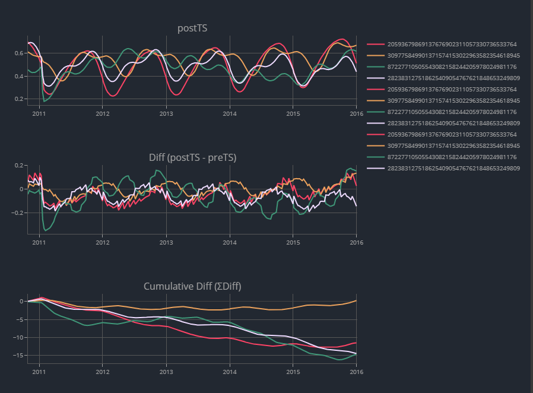

## ComputeAnomaly.jl

* **Function : computeAnomaly**
  * Calculates the anomaly by computing cumulative difference between the post eruption time series signal and mean pre eruption time series signal.
  * Input arguments
    * ptId : Point Id
        * either give name of point 205936798913767...
        * or set to NaN
    * Data : Dataframe containing columns id, time and target column
    * target : NDVI data
        * i.e LSSR.NDVI
    * eDate : Eruption date
        * i.e : Date(2010,10,26)
    * noPoints : optional argument
        * set ptId to NaN if using this argument
        * give the number of unique points that requires to be computed (more than one geographical point can be calculated)

* **Function : plotAnom**
  * Plots Post eruption time series signal, diff and cumulative diff
  * Input arguments
    * df : dataframe with columns time, post-eruption-target, diff, cumulative diff
