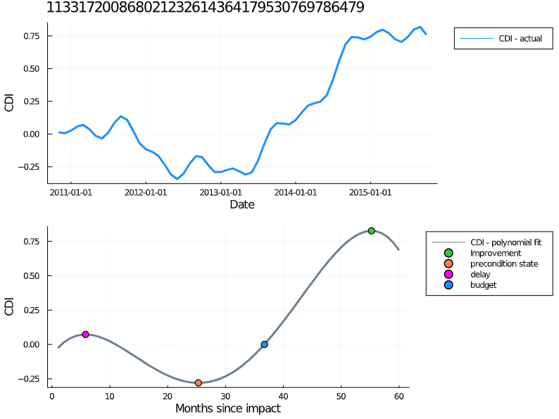
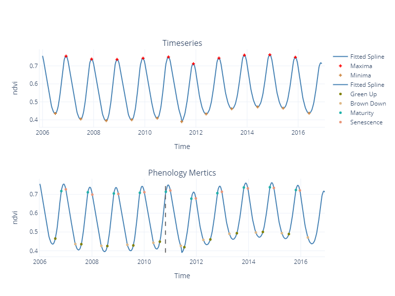

# Impact Recovery Metrics

## ImapctRecoveryMet.jl - Julia function
* Finds impact and recovery metrics by fitting a polynomial function to anomaly time series signal.

  `include(path/ImpactRecoveryMet)`
  
  `df,met = anomMet(data,"113317200868021232614364179530769786479","LSSR.EVI.CDI")`
  
  `anomPlot(df,met)`
  
* anomMet - fits polynomial function to anomaly data and returns anomaly metrics
  * Inputs
    * data - csv file with following columns
      * id:String - id for geographical points
      * time:String - date time 
      * CDI:Float64 - Post eruption anomaly signal
    * idNo:Any - Either string or NaN, if NaN set optional parameter uniqIdIdx to the index required
    * timeThresh:Int64 - time threshold to ignore delay metrics after, By default set to 12 months
  * Outputs
    * df::DataFrame
    * metrics::Dictionary
      * delay - delay of impact effect if present (maxima found only within a range of 12 months default)
      * precondition state - first minima observed, roots of first dervavitive, f'(x) where second dervative, f''(x) > 0  
      * budget - roots of polynomial function f(x)
      * Improvement - first maxima, roots of first dervative f'(x) where second deravative, f''(x) < 0
    
* anomPlot - returns Plots figure with fitted function and metrics
  * Inputs
    * df::DataFrame - Dataframe returned from anomMet function
    * met::Dictionary - Metrics returned from the anomMet function
  

# Phenology Metrics

## extPhenLite.py - python class
* To extract phenology metrics

  `from ectPhenLite import ExtPhen`
  
  `data = pd.read_csv("path/data.csv)`
  
  `inst = ExtPhen(data = data, target = "fitted.values", eDate = "2010-10-26")`
  
  `phenMetrics = inst.getPhenMet()`
  
  `erupPhase = inst.erupPhase`
  
  `#To visualize`
  
  `fig = inst.visPlot()`
  
  `fig.show()`

* Inputs
  * data - csv file with containing the following columns
    * time::str
    * fitted.values::float
  * eDate::str - eruption date 
* Outputs
  * inst.getPhenMet::pd.DataFrame - Outputs the phenology metrics captured in the time series
    * amp - amplitude of peaks
    * greenupT/greenupV - season start time/value, attain 10% of amplitude from left side
    * browndownT/browndownV - season end time/ value, attain 10% of amplitude from right side
    * matuarityT/matuarityV - matuarity time/value, attain 90% of ammplitude from left side
    * senescenceT/senescenceV - senescence time/value, attain 90% of amplitude from right side
    * LOS - length of season (browndownT - greenupT)
    * maxT - time at maximum value within a season
    * maxV - maximum value within a season
    * midseasonT - time at mid point of the season
    * growSeasArea - area below greenup and browndown dates
  * inst.erupPhase::str - season during eruption phase 
  * inst.visPlot::plotly.graph.objs.Figure
